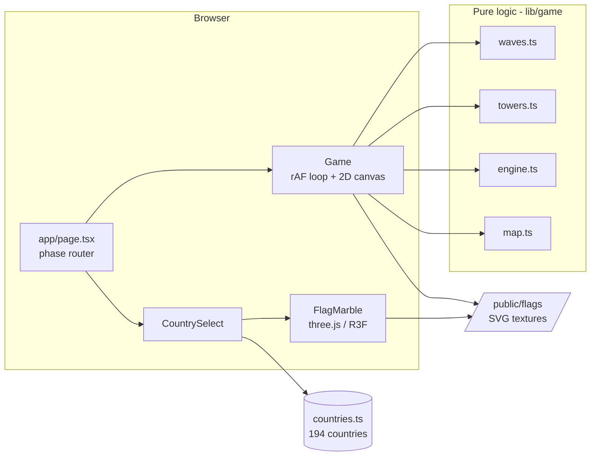

# Country Defense

Pick any of the world's 194 countries as a glossy 3D flag marble, then defend it from 12 escalating waves of invaders using 6 upgradeable towers. A clean, kid-friendly tower-defense game that runs entirely in the browser.


[](LICENSE)


Play it live: **https://country-defense-bheng.vercel.app**

## Contents

- [Features](#features)
- [Gameplay](#gameplay)
- [Architecture](#architecture)
- [Tech stack](#tech-stack)
- [Quick start](#quick-start)
- [Development](#development)
- [Configuration](#configuration)
- [Project layout](#project-layout)
- [License](#license)

## Features

- **Pick from all 194 recognized countries**, searchable by name or continent.
- **Glossy 3D flag marble** you can drag to spin before the match - a real WebGL sphere wrapped in your country's flag with a clearcoat sheen.
- **12 escalating waves** of 10 invaders each; every wave the enemies gain +28% health and +7% speed, so you have to keep upgrading.
- **6 distinct tower types**, each with its own role - Laser (fast steady beam), Rapid (machine-gun), Frost (slows enemies), Cannon (splash), Tesla (chain lightning), and Sniper (very long range).
- **Upgrade towers to level 3** (+45% damage, +12% range per level) or sell them back for 60% of what you spent.
- **Clean, minimal, kid-friendly UI** - solid black background, colorful glossy marbles, big touch targets, safe-area aware, and a smooth 60fps game loop.
- **No accounts, no data, no backend** - fully static and client-side.


## Gameplay

1. Search and tap a country - it appears as a spinning glossy flag marble. Tap **Defend**.
2. Your country's marble sits at the end of an S-shaped path. Tap open tiles to build towers.
3. Tap **Start Wave**. Invader marbles stream in along the path; your towers auto-fire.
4. Killing invaders earns gold; clearing a wave pays a bonus. Spend it on new towers or upgrades.
5. Each invader that reaches your base costs a life. Survive all 12 waves to win; run out of lives and it is game over. Play again instantly.

## Architecture

The game is split into a **pure, DOM-free simulation** (`lib/game`) and a thin React/WebGL/canvas presentation layer. All 60fps mutable state (enemies, towers, projectiles) lives in refs so the animation loop never triggers a React re-render; the HUD updates only when a value actually changes.



| Layer | Role |
|-------|------|
| `app/page.tsx` | Two-state router: the country picker until a country is chosen, then the game |
| `components/CountrySelect` + `FlagMarble` | Picker UI and the lazy-loaded three.js glossy marble |
| `components/Game.tsx` | Owns the requestAnimationFrame loop, refs-as-state, and the 2D canvas renderer |
| `lib/game/{types,map,waves,towers,engine}` | Deterministic, DOM-free simulation - path math, wave scaling, tower combat |
| `lib/countries.ts` + `lib/flagImage.ts` | 194-country data and the cached SVG-to-texture pipeline |
| `tests/game.test.ts` | 22 `node:test` cases over the entire simulation layer |

## Tech stack

- **Next.js 16** (App Router, static export) and **React 19**
- **TypeScript** in strict mode
- **three.js** + **@react-three/fiber** + **@react-three/drei** for the 3D marble
- **HTML5 Canvas 2D** for the tower-defense arena (performant, no WebGL needed for gameplay)
- **Tailwind CSS 4** for the UI
- **node:test** for unit tests, **ESLint** + **tsc** for quality gates
- **Vercel** for hosting, **GitHub Actions** for CI

## Quick start

```bash
git clone https://github.com/bunlongheng/country-defense.git
cd country-defense
npm install
npm run dev
```

Open **http://localhost:3033**.

> Requires Node 22.6 or newer (the test runner uses `--experimental-strip-types`).

## Development

```bash
npm run dev        # dev server on http://localhost:3033
npm run build      # production build
npm run lint       # ESLint
npm run typecheck  # tsc --noEmit (includes tests)
npm test           # 22 node:test cases over lib/game
```

Git hooks (via Husky) run the tests on commit and lint + typecheck on push. CI runs lint, typecheck, tests, and a production build on every push and pull request.

## Configuration

No environment variables are required to run, build, or deploy this app. It is fully static and client-side.

## Project layout

```
app/
  layout.tsx            root layout, metadata, black theme
  page.tsx              phase router (picker <-> game)
  globals.css           Tailwind + base styles
components/
  CountrySelect.tsx     194-country picker + search + marble preview
  FlagMarble.tsx        three.js glossy flag sphere (drag to spin)
  Game.tsx              rAF game loop, HUD, tower shop, 2D canvas renderer
lib/
  countries.ts          194 recognized countries + search helpers
  flagImage.ts          cached SVG-to-Image/texture pipeline
  game/
    types.ts            shared game types (tile-unit coordinates)
    map.ts              arena grid + path geometry
    waves.ts            wave composition and hp/speed scaling
    towers.ts           6 tower definitions, upgrade/sell, targeting
    engine.ts           pure per-frame step: move, fire, splash, chain, reap
public/flags/           194 self-hosted flag SVGs
tests/game.test.ts      22 unit tests over the simulation layer
```

## License

[MIT](LICENSE) (c) Bunlong Heng
